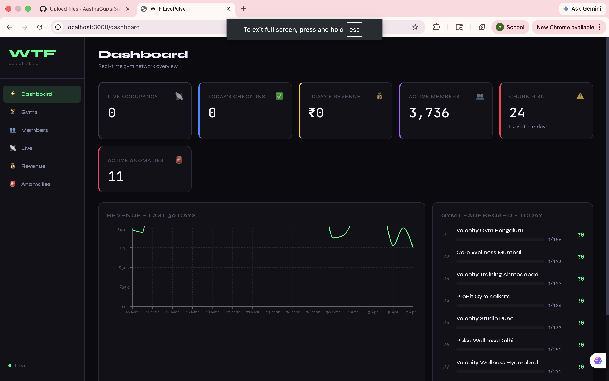
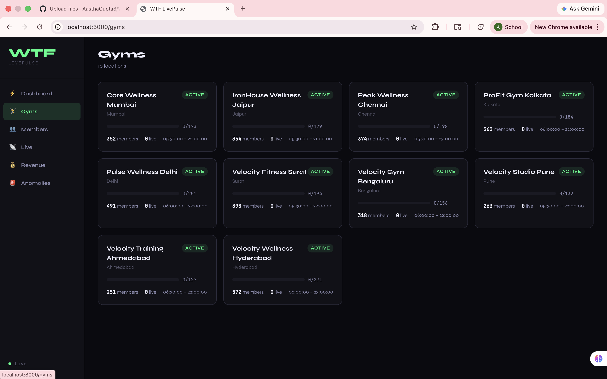
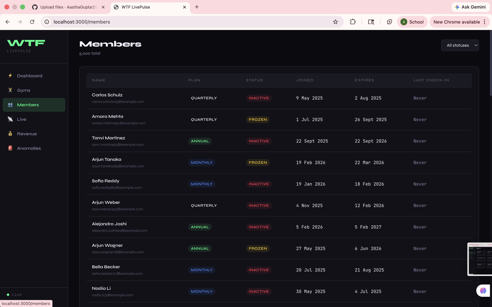
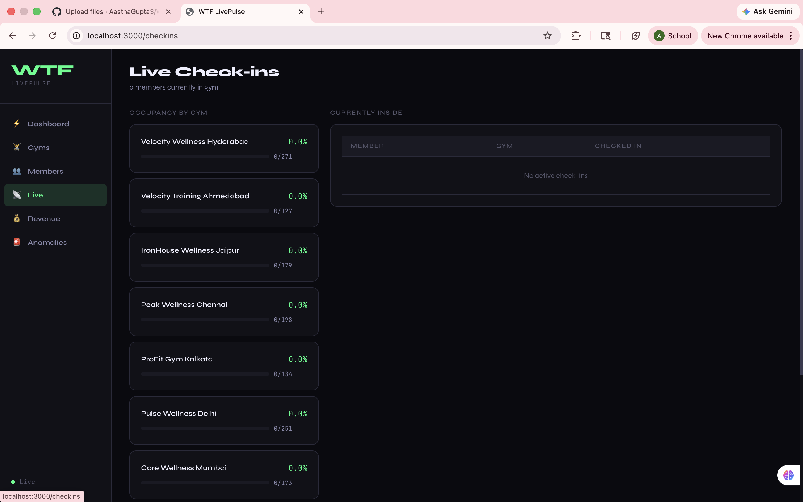
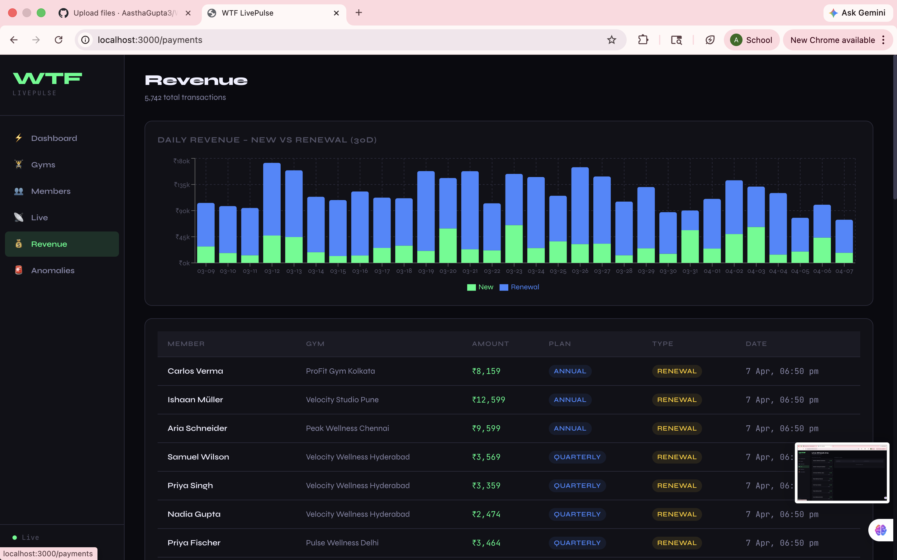
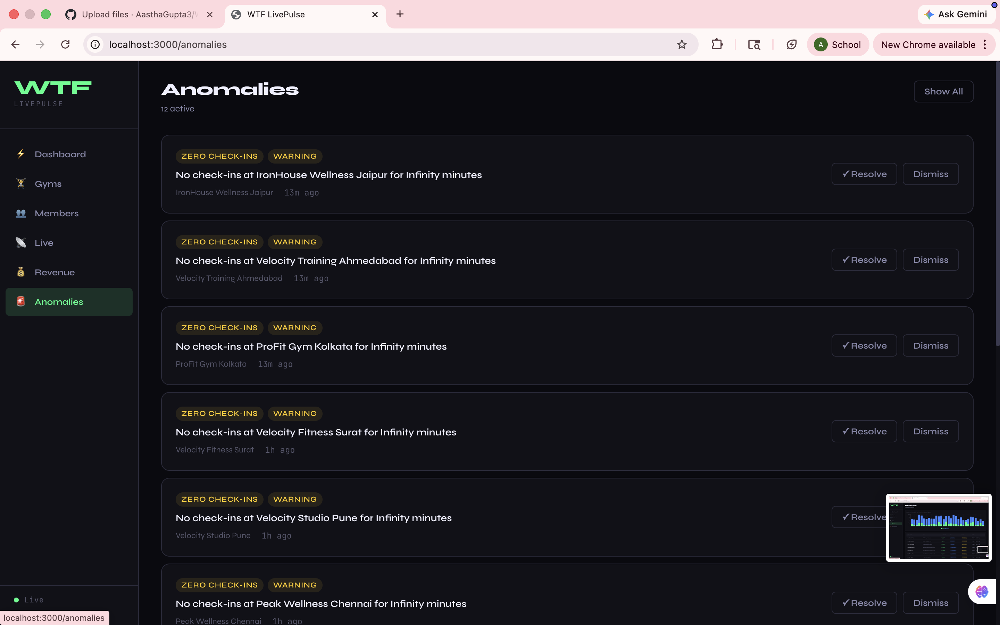

# WTF LivePulse

Real-time gym analytics dashboard with:
- Node.js + Express backend
- PostgreSQL database
- React + Vite frontend
- Docker Compose local setup

## Project Structure

```text
New project/
├── .gitignore
├── README.md
└── wtf-livepulse/
    ├── docker-compose.yml
    ├── .env.example
    ├── backend/
    └── frontend/
```

## Prerequisites

- Docker Desktop installed and running
- Git

## Quick Start

From repository root:

```bash
cd "wtf-livepulse"
docker compose up --build
```

Open:
- Frontend: http://localhost:3000/dashboard
- Backend health: http://localhost:3001/health

## Screenshots

### Dashboard


### Gyms


### Members


### Live Check-ins


### Revenue


### Anomalies


## Seed Demo Data

In a new terminal:

```bash
cd "wtf-livepulse"
docker compose exec backend npm run seed
```

Refresh the dashboard after seeding.

## Common Commands

Start services:

```bash
cd "wtf-livepulse"
docker compose up
```

Stop services:

```bash
cd "wtf-livepulse"
docker compose down
```

Reset database volume:

```bash
cd "wtf-livepulse"
docker compose down -v
docker compose up --build
```

## Troubleshooting

If the dashboard is blank or API is not reachable:

```bash
cd "wtf-livepulse"
docker compose logs backend
```

If dependencies are missing inside backend container:

```bash
cd "wtf-livepulse"
docker compose run --rm backend npm install
docker compose up --build
```
